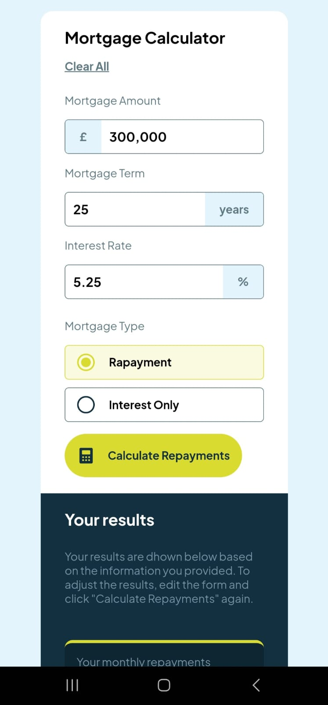
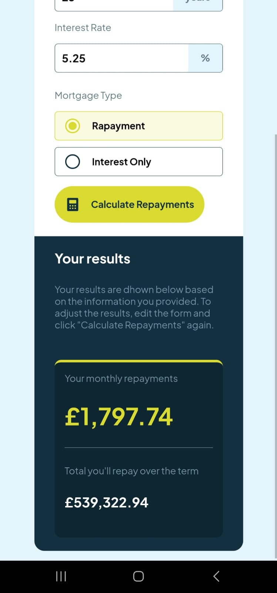

# Frontend Mentor - Mortgage repayment calculator solution 

This is a solution to the [Mortgage repayment calculator challenge on Frontend Mentor](https://www.frontendmentor.io/challenges/mortgage-repayment-calculator-Galx1LXK73). Frontend Mentor challenges help you improve your coding skills by building realistic projects.

## Table of Contents

- [Overview](#overview)
- [The Challenge](#the-challenge)
- [Screenshot](#screenshot)
- [Links](#links)
- [My Process](#my-process)
- [Built with](#built-with)
- [What I Learned](#what-i-learned)
- [Continuous Development](#continuous-development)
- [Usepful Resources](#useful-resources)
- [Author](#author)

## Overview

### The challenge

Users should be able to:

- Input mortgage information and see monthly repayment and total repayment amounts after submitting the form
- See form validation messages if any field is incomplete
- Complete the form only using their keyboard
- View the optimal layout for the interface depending on their device's screen size
- See hover and focus states for all interactive elements on the page 

### Screenshot
 
 
 
 
 
 
 
 
 

### Links

- Solution URL: (https://github.com/1MperaDOR0/calculadora-de-amortiza-o-de-hipoteca.github.io)
- Live website URL: (https://1mperador0.github.io/mortgage-amortization-calculator.github.io/)

## My process

### Built with

- Markup languages ​​(HTML5 and CSS3)
- Semantic framework
- Flexbox and responsiveness
- Programming language (JavaScript)
- Interactivity
- Modular Functions

### What I learned

1. Basic Structure and Functionality:
Objective: The calculator's purpose is to calculate the monthly payments and the total paid over time for a mortgage loan, based on three main inputs: loan amount mortgage, interest rate and repayment term. Monthly Payment Calculation: The code uses the mortgage payment formula, which includes the application of a periodic interest rate and the term of the loan.

Formula:
M = P * (r (1 + r)^n / (1 + r)^n - 1)

Where:
M = monthly payment
P = principal amount
r = monthly interest rate (annual interest rate / 12)
n = total number of payments (loan term in years × 12)

2. Improvements in Usability:
Number Formatting: JavaScript implementation allows automatic insertion of commas to separate thousands in amounts and other numbers, improving readability.
Example: When typing "300000", the calculator automatically converts it to "300,000".

3. Comparison of Results:
During testing, it was observed that there are slight differences in the decimal places in the results of "Your monthly repayments" and "Total you'll repay over the term" due to rounding, which reflects the accuracy of the calculation. Differences like 0.01 in monthly payment and 1.98 in total paid are acceptable in the context of large sums and long periods.

4. Challenges Overcome:
JavaScript Implementation: As a beginner, there were challenges in implementing JavaScript code, but practice with event handling, calculations and number formatting helped improve understanding.
Precise Calculations: Formulas involve precise mathematical operations, and it was important to understand how small changes in the input data (interest rate, amount, term) can significantly influence the final results.

### Continuous development

With this challenge I was able to understand how many gaps still need to be filled. In particular, I had more difficulty developing the code following the logic of the hypothetical calculation and also in the mathematical commands part of the javascript. So I need to further develop my skills so that they become even more refined and I can make the code cleaner and more understandable.

### Useful Resources

- [How to Calculate Mortgage](https://www.rocketmortgage.com/learn/how-to-calculate-mortgage) - This helped me solve the problems of doing the calculator calculations . I really liked this pattern and will use it from now on.
- [Math concept in javascript](https://www.digitalocean.com/community/tutorials/how-to-do-math-in-javascript-with-operators ) - This helped me use logic to do the calculations on the calculator. I really liked this pattern and will use it from now on.

## Author

- Frontend Mentor - [@1MperaDOR0](https://www.frontendmentor.io/profile/1MperaDOR0)
- GitHub - [1MperaDOR0](https://github.com/1MperaDOR0)
